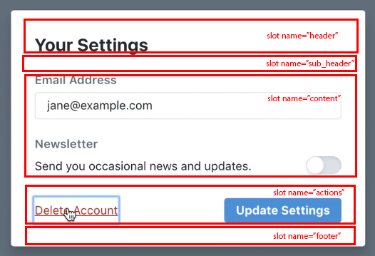

CONTENT
=================

<div id="handing-the-errors-with-props"></div><br>

## Chap 0 : HANDLING THE ERRORS WITH PROPS

NOTE: <br>
✔ Khi làm việc với `props`, việc không tin bất cứ data nào truyền vào từ parent là có cơ sở (lỗi API, lỗi logic bên BE, lỗi name file,...) <br>
✔ Việc `cover các case` xuất hiện với data truyền vào là thực sự cần thiết đối với việc handing errors on production <br>
✔ Sử dụng các mệnh đề có sẵn: `type` `required` `default` `validator` <br>

<br/>

NOTE: <br>
✔ Xảy ra trường hợp, data điền đúng kiểu nhưng bị sai value (sai định dạng, sai kiểu value,...) <br>
✔ Validator dữ liệu có thể gây dài dòng, nhưng sẽ là tuyệt với nếu bạn handling errors ngay từ lúc khởi điểm <br>

<br/>

Extend: <br>
✔ Vậy chúng ta có thể tạo 1 helper (custom hook) cho việc validator này đúng không nhỉ <br>
✔ Error mặc định của Vue thường không rõ ràng, chúng ta có thể customize lại message <br>
✔ Ex: validator type of images (allow *.jpg || *.png) <br>

```
// file component want to use helper
import { validatorImageType } from '../helpers/validatorImageType.js'

// file helper validatorImageType
const validatorImageType = (propString) => {
  const hasImagesDirectory = propString.indexOf('/images/') > -1
  const isPNG = prop.endWith('.png')
  const isJPG = prop.endWith('.jpeg') || prop.endWith('.jpg')

  return hasImagesDirectory && isPNG && isJPG
}
export default validatorImageType
```


<div id="building-controlled-components"></div><br>

## Chap 1 : BUILD CONTROLLED COMPONENTS

`SANBOX CODE`: [building-controlled-components](https://codesandbox.io/s/oxxlx055xy?from-embed)

NOTE: <br>
✔ Bản chất của `v-model` là việc lắng nghe `input`(:modelValue="pageTitle") và emit dữ liệu(@update:modelValue="pageTitle = $event") <br>
✔ `v-model` chỉ nên dùng cho `input` và `component` => không nên sử dụng cho các thành phần khác <br>
✔ Sử dụng `emit` và `gộp các emit` <br>
✔ `form` tối ưu bằng cách loại bỏ real-time sync in input `@input.once` => chỉ check khi click submit <br>
✔ Sử dụng `Object.fromEntries(new FormData(event.target))` thay cho `v-model` nếu dùng với form nhiều thành phần <br>
✔ Khi `emit`data, chỉ sử dụng từ `update:someModelValue` khi thao tác với `v-model` => với các component thì bỏ từ `update` để tránh gây hiểu nhầm <br>

- Khi thao tác với `form elements`(input, checkbox, select,..) hãy linh động trong việc xử lý các `$emit` và `props` => hãy tách các `form elements` thành các components riêng lẻ và để trong `global components / common components` <br>
<br/>

- Hãy sử dụng `emit gộp` của Vue3 để việc control được hiệu quả hơn
```
https://v3.vuejs.org/guide/component-custom-events.html#event-names
===================

// Emit with Vue3: setup(...)
emits: ['your-event', 'handle-confirm-del-data'],
setup(props, { emit }) { 
  ...
  emit('your-event', dataWantToEmit); // Hoặc sử dụng context(attrs, slots, emit) cho nó ngắn: setup(props, context) {} || context.emit('yourEvent', dataWantToEmit);
  emit("handle-confirm-del-data", false); //data to close del dialog
}
<your-child @your-event="onYourEvent" />
onYourEvent(dataWantToEmit) {
  ...
}

// Gộp các emit trong 1 setup
<ChildComponent v-model="pageTitle" />

export default {
  props: {
    modelValue: String // previously was `value: String`
  },
  emits: ['update:modelValue'],
  methods: {
    changePageTitle(title) {
      this.$emit('update:modelValue', title) // previously was `this.$emit('input', title)`
    }
  }
}
```

- Sử dụng `v-model` làm tối giản lại phong cách code và nhanh gọn <br>
Vue 2: <br>
<br/>

```
Vue 3 thay đổi syntax của v-model:

<ChildComponent v-model="pageTitle" />

<!-- shorthand for: -->
<ChildComponent
  :modelValue="pageTitle"
  @update:modelValue="pageTitle = $event"
/>

```

- `v-model` có thể sử dụng với các element không thuộc hệ thống `form elements` => với điều kiện chỉ có 1 element duy nhất có trong `component`

```
// Normal with form elements
<input @input="email = $event.target.value">

// Special with element not belong to form
<some-component :modelValue="newLetter" @update:modelValue="(newValue) => { newLetter = newValue }"></some-component>
```

```
//Child component
setup(props, { emit }) {
   ...
   emit('your-event', dataWantToEmit);
}

//Parent component
<your-child @your-event="onYourEvent" />

onYourEvent(dataWantToEmit) {
  console.log(dataWantToEmit)
}
```

- Việc lắng nghe liên tục mọi `keydown` || `clicked` khi `end-user` thao tác trên form chỉ thực sự đúng đắn khi làm việc với `reactive form` (form muốn response trực tiếp hành động của user) => hãy tối giản bằng việc khi `submit mới lắng nghe` => giải phóng được 1 phần bộ nhớ và giảm tình trạng lag nếu làm với super form.
```
@input.once
```


<div id="customizing-controlled-component-bindings"></div><br>

## Chap 2 : CUSTOMIZING CONTROLLED COMPONENT BINDINGS

`SANBOX CODE`: [customizing-controlled-component-bindings](https://codesandbox.io/s/mqnzm84plx?from-embed)

NOTE: <br>
✔ `v-model` default sẽ không được tự nhiên vì sử dụng `modelValue` & `update:modelValue` => có thể custom bằng các value cụ thể <br>

```
//Parent
<Custom-component v-model:message="message" />

//Child
<input type="text" :value="message" @input='emit("update:message", $event.target.value);'>
```
## Chap 3 : WRAPPING EXTERNAL LIBRARIES AS VUE COMPONENTS

`SANBOX CODE`: [wrapping-external-libraries-as-vue-components](https://codesandbox.io/s/n4qolyr42m?from-embed)

NOTE: <br>
✔ Hãy chú ý sử dụng các method có sẵn của lib để custom lại các event <br>

- Đôi khi, việc thêm 1 thư viện ngoài(datePicker) vào để gọi trong input gây phiền toái nhất định: $event chọn ngày không cập nhật với biến ref thông thường. Vì chúng không được tạo ra để sync với biến đó => hãy sử dụng các custom event của lib (onSelect()) để xác định event click day. <br>
- https://github.com/b0yblake/Vue3-Form-Best-Practice/blob/main/src/components/common/form/DatepickerPikaday.vue

## Chap 4 : ENCAPSULATING EXTERNAL BEHAVIOR CLOSING ON ESCAPE

`SANBOX CODE`: [encapsulating-external-behavior-closing-on-escape](https://codesandbox.io/s/1v1o4lvp9j?from-embed)

NOTE: <br>
✔ `Web accessibility` luôn luôn đặt lên hàng đầu mỗi khi thao tác với dialog <br>
✔ Dialog khi bật lên cần được kiểm soát cả ở phần `keyboard`: `close = esc, enter, blankspace` <br>
✔ Hành vi người dùng cần được chú trọng khi họ dùng `keyboard` <br>
✔ Đối với những DOM sinh ra sau `lifecycle:created`, nếu muốn control được, nên sử dụng `nextTick` hoặc sử dụng vanila js tại thời điểm click <br>
✔ Hãy linh động trong việc sử dụng js, chú ý đến việc tối ưu hiệu suất (dùng js tối ưu được hiệu suất ngay tại component do không phải `v-model` 2way-binding) <br>

```
Way1: sử dụng keydown = esc button, enable tabindex để có thể focus được 
@keydown.esc="handleEsc" tabindex="0" ref="dialog"

Way2: sử dụng vanila js nhằm bắt sự kiện click tại thời điểm dialog đã sinh ra (không cần care về việc sinh ra hay sau dom update)

=======================
methods: {
  createClickEvent: function() {
    let self = this;

    document
      .querySelector(".util_per_pay_rate .btn_open_dialog")
      .addEventListener("click", function() {
        self.dialog = true;
      });
  }
},
mounted() {
  this.createClickEvent();
}
========================
created() {
  document.addEventListener('keydown', (e) => {
    if(e.key === 'Escape' && this.show) {
      this.createClickEvent();
    }
  })
}
```

## Chap 5 : ENCAPSULATING EXTERNAL BEHAVIOR BACKGROUND SCROLLING

`SANBOX CODE`: [encapsulating-external-behavior-background-scrolling](https://codesandbox.io/s/z0mx3w9km?from-embed)

NOTE: <br>
✔ Khi bật `Dialog` vấn đề gặp phải là chúng ta cần remove scroll: hãy chú ý về cách sử dụng bằng class toggle tại body => chúng sẽ hữu hiệu khi chúng ta handle được, còn không => hãy sử dụng vanila js <br>
✔ Hãy cố gắng cover 1-2 case tiếp theo sau này khi mở rộng app <br>

```
watchEffect(() => {
  props.active ? props.preventBackgroundScrolling && document.body.style.setProperty('overflow', 'hidden') : props.preventBackgroundScrolling && document.body.style.setProperty('overflow')
})
```

```
watch(() => props.selected, (first, second) => {
  console.log(
    "Watch props.selected function called with args:",
    first,
    second
  );
});
```

## Chap 6 : ENCAPSULATING EXTERNAL BEHAVIOR PORTALS

`SANBOX CODE`: [encapsulating-external-behavior-portals](https://codesandbox.io/s/vy0k8283o5?from-embed)

NOTE: <br>
✔ Với các `dialog` trên từng component, hãy cứ viết ở trên các components để dễ handle data, sau đó sử dụng `teleport` kết hợp với `slot` <br>
✔ Việc handle data của tất cả các popup ở cùng 1 component trung gian đem lại hiệu quả rõ rệt so với việc handle data tại các component common <br>
https://github.com/b0yblake/Vue3-Form-Best-Practice/blob/main/src/views/Form.vue <br>

```
//index.html
<body>
  <div id="app"></div>
  <!-- Use teleport to move dialog to here -->
  <div id="layer"></div>
</body>

// Component
<teleport to="#layer">
  <some-component-dialog :data="data" @click="some-element" />
</teleport>
```

## Chap 7 : ENCAPSULATING EXTERNAL RESING PORTALS

`SANBOX CODE`: [encapsulating-external-behavior-reusing-portals](https://codesandbox.io/s/xv1ooy9v1p?from-embed)

NOTE: <br>
✔ `teleport` hiệu quả với multiple => cái nào được move trước sẽ xuất hiện trước <br>

## Chap 8 : INJECTING CONTENT USING SLOTS

`SANBOX CODE`: [injecting-content-using-slots](https://codesandbox.io/s/8x54ow4vl9?from-embed)

DON'T LET YOURSELF TURN INTO THIS CASE: <br>
✔ Bạn đinh sloved 1 required đơn giản với nhiều case tại 1 button <br>
✔ Button đó có các case `spin` `title` `icon left` `icon right` ,.. <br>
✔ Hãy đúng đắn suy nghĩ trước khi làm 1 component <br>

<br/>


NOTE: <br>
✔ `SLOT` là 1 tính năng cực kỳ hay ho cho việc tái sử dụng tối đa số lần components xuất hiện. <br>
✔ Việc kết hợp cùng với class tại `component tag` cũng đem lại sự tiện lợi cho việc tái xử dụng component <br>

<br/>

```
// Tái sử dụng với trường hợp đặt các case cố định cho các vùng của header
// Parent
<dialog>
  <template #header>
    <h1>Dialog main</h1>
  </template>
  <template #default>
    <h1>Dialog main</h1>
  </template>
  ...
</dialog>

// Child popup
<template>
  <div class="c-base-popup">
    <div v-if="??" class="c-base-popup__header">
      <slot name="header"></slot>
    </div>
    <div v-if="??" class="c-base-popup__subheader">
      <slot name="subheader"></slot>
    </div>
    <div class="c-base-popup__body">

      //Default slot
      <slot></slot> 

      <h1>{{ title }}</h1>
      <p v-if="description">{{ description }}</p>
    </div>
    <div v-if="??" class="c-base-popup__actions">
      <slot name="actions"></slot>
    </div>
    <div v-if="??" class="c-base-popup__footer">
      <slot name="footer"></slot>
    </div>
  </div>
</template>
```

## Chap 9 : NATIVE STYLE BUTTONS USING SLOTS AND CLASS MERGING

`SANBOX CODE`: [native-style-buttons-using-slots-and-class-merging](https://codesandbox.io/s/j4m180n11v?from-embed)

NOTE: <br>
✔ CLass có thể merging giữa component tag & first-element-in-component <br>

```
<!-- Common dialog -->
<BadgeDialog :dataDialog="form" v-model:active="activeDialog" v-show="activeDialog" class="flex">

// BadgeDialog component
<template>
  <div class="nes-dialog abc" id="badge-dialog"></div>
</template>

// Result
<div class="nes-dialog abc flex" id="badge-dialog"></div>
```

## Chap 10 : EXTENDING COMPONENTS USING COMPOSITION (SPECIAL)

`SANBOX CODE`: [extending-components-using-composition](https://codesandbox.io/s/jj8vjjxlk9?from-embed)

NOTE: <br>
✔ Chú ý khi sử dụng compositionAPI => cấu trúc `ref & reactive` sẽ gây khó khăn <br>
✔ Việc tái sử dụng component luôn được đặt lên hàng đầu => hãy xem kỹ ví dụ để thấy được hiệu quả khi sử dụng component trung gian <br>

<br/>

```
//Sử dụng Object.assign cho custom hook (composables)

  setup() {
    const initialState = {
      name: "",
      lastName: "",
      email: ""
    };

    const form = reactive({ ...initialState });

    function resetForm() {
      Object.assign(form, initialState);
    }

    function setForm() {
      Object.assign(form, {
        name: "John",
        lastName: "Doe",
        email: "john@doe.com"
      });
    }

    return { form, setForm, resetForm };
  }
```

## Chap 11 : PASSING DATA UP USING SCOPED SLOTS

`SANBOX CODE`: [passing-data-up-using-scoped-slots](https://codesandbox.io/s/nwz1xpkyl0?from-embed)

NOTE: <br>
✔ Khi ta sử dụng data tại `Child` (vì nhiều lý do), mà parent là nơi call `component tag`: <br>
✔ NEW way: `props` đôi khi có thể truyền dưới dạng function (thay vì data như trước) => Chỉ là cách tham khảo, ít người thích dùng kiểu này vì rườm ra và k flexable <br>
✔ HIGH RECOMMEND: Sử dụng `slot` như 1 dạng flexiable code, để layout có thể tùy chỉnh theo parent mà vẫn sử dụng data tại child <br> 

<br/>

```
======= Sử dụng data tại child như props ===============
// Parent
<contact-list :pseudo-slot="({ contact }) => contact.name.first"></contact-list>

// Child
<div class="child">
  {{ pseudoSlot({ contact: contact }) }}
</div>
```

```
======= Sử dụng data tại child => passing data ngược lại parent thông qua slot ===============
// Parent
// Có thể custom layout như này
<contact-list>
  <a slot-scope="{ contact }" :href="`/contacts/${contact.id}`">
    {{ contact.name.first }}
  </a>
</contact-list>

// Hoặc như này
<contact-list>
  <div slot-scope="{ contact }">
    <strong class="user-title">{{ contact.name.first }}</strong>
  </div>
</contact-list>

// Child
<div class="child">
  <slot :contact="contact"></slot>
</div>
```

## Chap 12 : RENDER FUNCTIONS 101

`SANBOX CODE`: [render-functions-101](https://codesandbox.io/s/5vxlz052px?from-embed)

NOTE: <br>
✔ 

## Chap 13 : RENDER FUNCTIONS AND COMPONENTS

`SANBOX CODE`: [render-functions-and-components](https://codesandbox.io/s/k05o3npx25?from-embed)

NOTE: <br>
✔ 

## Chap 14 : RENDER FUNCTIONS AND CHILDREN

`SANBOX CODE`: [render-functions-and-children](https://codesandbox.io/s/7w1pr58p6x?from-embed)

NOTE: <br>
✔ 

## Chap 15 : RENDER FUNCTIONS AND SLOTS

`SANBOX CODE`: [render-functions-and-slots](https://codesandbox.io/s/z2k1j94o8m?from-embed)

NOTE: <br>
✔ 

## Chap 16 : DATA PROVIDER COMPONENTS

`SANBOX CODE`: [data-provider-components](https://codesandbox.io/s/nk9qr8yz0p?from-embed)

NOTE: <br>
✔ 


16. 
17. [getting-started-with-renderless-ui-components](https://codesandbox.io/s/x1z0myl0p?from-embed)
18. [passing-data-props-from-renderless-components](https://codesandbox.io/s/k96ljlz7yv?from-embed)
19. [passing-action-props-from-renderless-components](https://codesandbox.io/s/9l2jwy14mp?from-embed)
20. [passing-binding-props-from-renderless-components](https://codesandbox.io/s/l5yoxyv02q?from-embed)
21. [renderless-ui-components-functions-as-binding-props](https://codesandbox.io/s/kn1nv6ypv?from-embed)
22. [implementing-alternate-layouts-with-renderless-components](https://codesandbox.io/s/1r789z3nnl?from-embed)
23. [configuring-renderless-components](https://codesandbox.io/s/l9v91jn0zq?from-embed)
24. [wrapping-renderless-components](https://codesandbox.io/s/5z5056yoq4?from-embed)
25. [element-queries-as-a-data-provider-component](https://codesandbox.io/s/20r8wnx44r?from-embed)
26. [building-compound-components-with-provide-inject](https://codesandbox.io/s/jl6pz69ox3?from-embed)
27. [building-a-compound-sortable-list-component](https://codesandbox.io/s/o98y1l735y?from-embed)
28. [building-a-search-select-data-bindings](https://codesandbox.io/s/ykypmk03xj?from-embed)
29. [building-a-search-select-filtering](https://codesandbox.io/s/oozwlvk36?from-embed)
30. [building-a-search-select-focus-management](https://codesandbox.io/s/o95oq681l6?from-embed)
31. [building-a-search-select-making-it-controlled](https://codesandbox.io/s/8n0mnm2v70?from-embed)
32. [building-a-search-select-keyboard-navigation](https://codesandbox.io/s/n7mw5871v0?from-embed)
33. [building-a-search-select-click-outside-component](https://codesandbox.io/s/w66mzknr27?from-embed)
34. [building-a-search-select-integrating-popperjs](https://codesandbox.io/s/vyxl1z5pp5?from-embed)
